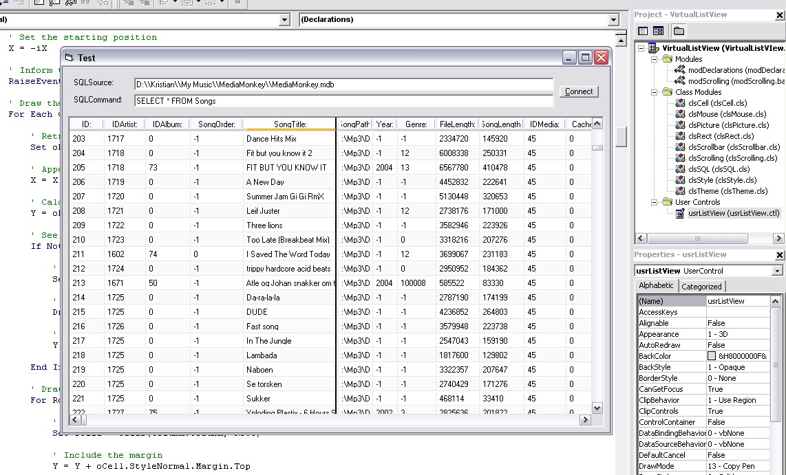



## Virtual Listview

### Description

This is a comprehensive implementation, written purely from scratch, of a virtual list view using a wide array of COM classes. Furthermore, it supports custom skins, XP skins natively, and a SQL connection withou much hassle. The ZIP-file includes a test project that shows you how to use this control in a project.
 
### More Info
 

             |
---                |---
**Submitted On**   |2006-09-20 23:35:32
**By**             |[Kristian S\. Stangeland](https://github.com/Planet-Source-Code/PSCIndex/blob/master/ByAuthor/kristian-s-stangeland.md)
**Level**          |Advanced
**User Rating**    |5.0 (30 globes from 6 users)
**Compatibility**  |VB 5\.0, VB 6\.0
**Category**       |[Custom Controls/ Forms/  Menus](https://github.com/Planet-Source-Code/PSCIndex/blob/master/ByCategory/custom-controls-forms-menus__1-4.md)
**World**          |[Visual Basic](https://github.com/Planet-Source-Code/PSCIndex/blob/master/ByWorld/visual-basic.md)
**Archive File**   |[Virtual\_Li2023561062006\.zip](https://github.com/Planet-Source-Code/kristian-s-stangeland-virtual-listview__1-66720/archive/master.zip)

